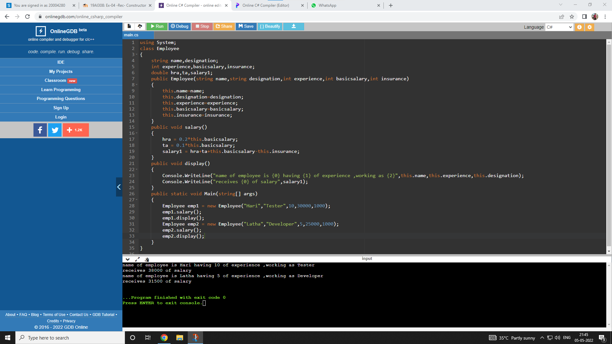

# Ex.No:1 To create a HelloWorld Activity using all lifecycles methods to display messages.


## AIM:

To create a HelloWorld Activity using all lifecycles methods to display messages using Android Studio.

## EQUIPMENTS REQUIRED:

Latest Version Android Studio

## ALGORITHM:

Step 1: Open Android Stdio and then click on File -> New -> New project.

Step 2: Then type the Application name as HelloWorld and click Next. 

Step 3: Then select the Minimum SDK as shown below and click Next.

Step 4: Then select the Empty Activity and click Next. Finally click Finish.

Step 5: Design layout in activity_main.xml.

Step 6: Display message give in MainActivity file.

Step 7: Save and run the application.

## PROGRAM:
```
/*
Program to print the text “Hello World”.
Developed by:Vijay kumar V.R.
Registeration Number : 212221040178

package com.example.myapp;

import androidx.appcompat.app.AppCompatActivity;

import android.os.Bundle;
import android.widget.Toast;

public class MainActivity extends AppCompatActivity {

    @Override
    protected void onCreate(Bundle savedInstanceState) {
        super.onCreate(savedInstanceState);
        setContentView(R.layout.activity_main);
        Toast t2=Toast.makeText(getApplicationContext(),"onCreate Executed", Toast.LENGTH_LONG);
        t2.show();
    }

    @Override
    protected void onStart() {
        super.onStart();
        Toast t2=Toast.makeText(getApplicationContext(),"onStart Executed", Toast.LENGTH_LONG);
        t2.show();
    }

    @Override
    protected void onPause() {
        super.onPause();
        Toast t2=Toast.makeText(getApplicationContext(),"onPause Executed", Toast.LENGTH_LONG);
        t2.show();
    }

    @Override
    protected void onResume() {
        super.onResume();
        Toast t2=Toast.makeText(getApplicationContext(),"onResume Executed", Toast.LENGTH_LONG);
        t2.show();
    }

    @Override
    protected void onRestart() {
        super.onRestart();
        Toast t2=Toast.makeText(getApplicationContext(),"onResume Executed", Toast.LENGTH_LONG);
        t2.show();
    }

    @Override
    protected void onStop() {
        super.onStop();
        Toast t2=Toast.makeText(getApplicationContext(),"onStop Executed", Toast.LENGTH_LONG);
        t2.show();
    }
    protected void onDestroy(){
        super.onStop();
        Toast t2=Toast.makeText(getApplicationContext(),"onDestroy Executed", Toast.LENGTH_LONG);
        t2.show();
    }
}

*/
```

## OUTPUT




## RESULT
Thus a Simple Android Application create a HelloWorld Activity using all lifecycles methods to display messages using Android Studio is developed and executed successfully.
